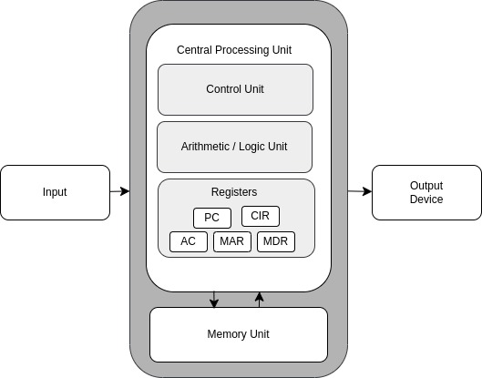

# Computer model

Architecture defines how computer works. It is also known as _computer model_. There are
two types of architecture:

- Von Neumann architecture;
- Harvard architecture.

## Von Neumann architecture

Von Neumann architecture was first published by John von Neumann in 1945.

His computer architecture design consists of a

* Control Unit,
* Arithmetic and Logic Unit (ALU),
* Memory Unit,
* Registers,
* Inputs/Outputs.

Von Neumann architecture is based on the stored-program computer concept, where
instruction data and program data are stored in the same memory. This design is still
used in most computers produced today.

### Central processing unit (CPU)

The Central Processing Unit (CPU) is the electronic circuit responsible for executing
the instructions of a computer program.

It sometimes referred to as the microprocessor or processor.

The CPU contains the ALU, CU and a variety of registers.

### Registers

Registers are high speed storage areas in the CPU. All data must be stored in a register
before it can be processed.

* __MAR__ - Memory Address Register. Holds the memory location of data that needs to be
accessed
* __MDR__ - Memory Data Register. Holds data that is being transferred to or from
memory.
* __AC__ - Accumulator. Where intermediate arithmetic and logic results are stored.
* __PC__ - Program Counter. Contains the address of the next instruction to be executed.
* __CIR__ - Current Instruction Register. Contains the current instruction during
processing.

### Arithmetic and Logic Unit (ALU)

The ALU allows arithmetic (add, subtract etc.) and logic (AND OR, NOT etc.) operations
to be carried out.

### Control Unit (CU)

The control unit controls the operation of the computer's ALU, memory and input/output
devices, telling them how to respond to the program instructions it has just read and
interpreted from the memory unit.

### Memory unit

The memory unit contains of RAM, sometimes referred to as primary or main memory. Unlike
a hard drive (secondary memory), this memory is fast and also directly accessible by the
CPU.

RAM is split into partitions. Each partition consists of an address and its contents (
both in binary form). The address will uniquely identify every location in the memory.

Loading data from permanent memory (hard drive), into the faster and directly accessible
temporary memory (RAM), allows the CPU to operate much quicker.

### Buses

Buses are means by which data is transmitted from one part of a computer to another,
connecting all major internal components to the CPU and memory.

A standard CPU system bus is comprised of a control bus, data bus and address bus.

* `Address Bus` carries the addresses of data (but not the data) between the processor
and memory.
* `Data Bus` carries data between the processor, the memory unit and the input/output
devices.
* `Control bus` carries control signals/commands from the CPU (and status signals from
other devices) in order to control and coordinate all activities within the computer.
