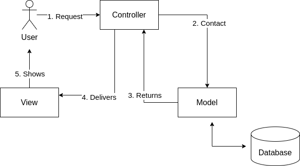

# MVC Design Pattern

The MVC (Model View Controller) design pattern is a software architecture pattern that
separates an application into three main components:

- Model;
- View;
- Controller.

The MVC design pattern specifies that an application consist of a data model,
presentation information and control information. The pattern requires that each of
these be separated into different objects.

The Model handles data, the View is what users see and the Controller connects the two.

## Model

The Model component demonstrates the data and business logic of an application. It is
responsible for managing the application's data, processing business rules and
responding to requests for information from other components, such as View and the
Controller.

## View

Displays the data from the Model to the user and sends user inputs to the controller for
processing. It does not directly interact with the Model.

## Controller

Controller acts as an intermediary between the Model and the View. It handles user input
and updates the Model accordingly and updates the View to reflect changes in the Model.
It contains application logic, such as input validation and data transformation.

## Communication between the components

- The user interacts with the View, such as clicking a button or entering text into a
form.
- The View receives the user input and forwards it to the Controller.
- The Controller receives the user input from the View. It interpreters the input,
performs any necessary operations (such as updating the Model), and decides how to
respond.
- The Controller updates the model based on the user input or application logic.
- If the model changes, it notifies the view.
- The View requests data from the Model to update its display.
- The controller updates the View based on the changes in the Model or in the response
to input.
- The View renders the updated UI based on the changes made by the Controller.
