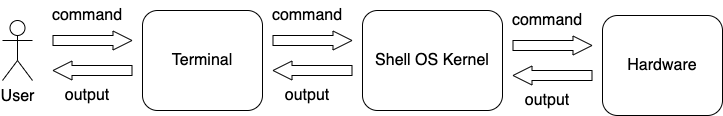

# Shell and Terminal

## Shell

The Linux shell is an [OS-level](architecture.md) application that interprets commands.
In early versions of Unix and Linux the shell was the only way to interact with the
operating system.

Some popular shell versions:

- sh (Bourne shell)
- bash (Bourne again shell)
- zsh, csh, tcsh, ...

To find out what the default shell is on your computer, enter

```shell
printenv SHELL
```

This returns the path to the default shell program.

It is able to switch between shells, by entering:

```shell
bash  # switch to bash
sh  # switch to sh
zsh  # switch to zsh
```

To end a terminal session enter `exit` command at the shell prompt.

## Terminal

When using a graphical user interface (GUI), we need another program called a *terminal
emulator* to interact with the shell. A terminal is an application where you enter the
commands you want to run and receive any output from those commands.

Let's see how are commands run.

1. We have a user who wants to run a command.
2. User enter the command in a terminal, which is then relayed to the shell - the core
component of the operating system.
3. Kernel translate the command for the hardware to perform.
4. When the hardware completes the command, kernel reads any changes or results and
sends them back via the shell to the terminal.



Once we launch the terminal, we should see the shell prompt. While it might vary in
appearance somewhat depending on the distribution, it will typically include your
*username@machinename*, followed by the **current working directory** and a dollar sign
(or other sign).

### Terminal prompt

The terminal prompt looks like this:

```shell
username@machinename dir %
```

If the last character of the prompt is a hash mark (`#`) rather than a dollar sign, the
terminal session has superuser privileges. This means either we are logged in as the
root user or we selected a terminal emulator that provides superuser (administrative)
privileges.

### Tab completion

Many shells support feature called **tab completion**. It allows you to complete a
command you are typing on the command line.

### Command history

If we press the up arrow, we will see that the previous command entered. This is called
command history. Most Linux distributions remember the last 1,000 commands by default.
Press the down arrow and the previous command disappears.

### Mice and focus

You can also use a mouse with your terminal emulator. It supports a quick copy-and-paste
technique. If you highlight some text by holding down the left mouse button and dragging
the mouse over it (or double-clicking a word), it is copied into a buffer. Pressing the
middle mouse button will cause the text to be pasted at the cursor location.

Ctrl-C and Ctrl-V don't work inside a terminal window. These control codes have
different meanings to the shell and were assigned many years before the release of
Microsoft Windows.
