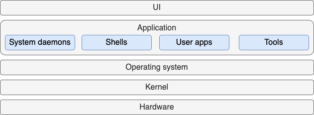

The Linux system comprises five distinct layers.

The outermost layer of the Linux Architecture is **user interface (UI)** which allows
users to interact with the system. Desktop versions of Linux include a graphical user
interface (GUI).

---

The **application** layer includes system daemons, shells, user apps, and tools used to
perform tasks in a Linux system. The applications communicate with the operating system
to perform tasks.

---

The **OS** responsible for jobs that are vital for system stability such as job
scheduling and keeping track of time, and detecting errors.

---

All Linux operating systems are built on top of the Linux **kernel** which performs the
most vital lower-level jobs. The kernel is the core component of the operating system
and is responsible for managing memory, processing and security.

---

The kernel interacts with the **hardware** layer, which includes all physical or
electronic devices in the computer such as processors, memory modules, input devices,
and storage.
