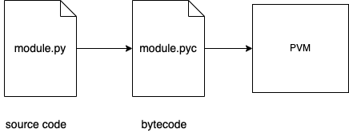

# Python interpreter

## What is interpreter

Python is a programming language. But it's also a software package called *interpreter*.

> An **interpreter** is a kind of program that executes other programs.

The Python interpreter reads your program and carries out the instructions it contains.
In effect, the interpreter is a lawyer of software logic between your code and a
computer hardware on your machine.

When the Python package is installed on your machine, it generates a number of
components - minimally an interpreter and a support library. Depending on how you use
it, the Python interpreter may take the form of an executable program, or a set of
libraries linked into another program. Depending on which flavor of Python you run, the
interpreter itself may be implemented as a C program, or set of Java classes, or
something else. Whatever form it takes, the Python code you write must always be run by
this interpreter. And to enable that, you must install the Python interpreter on your
computer.

The version of the installed interpreter.

```shell
python3 --version
# or
python3 -V
```

## Interpreter under the hood

In its simplest form, a Python program is just a text file containing Python statements.
By convention, Python program files are given names that end in `.py`. Technically, this
naming scheme are required only for files that are *imported* but most Python files have
`.py` names for consistency.

Simple Python script named `script.py`.

```python
print('Hello world')
print(1 + 1)
```

After you've typed this program, you must tell Python to execute the file.

```shell
$ python3 script.py
Hello world
2
```

When you instruct Python to run your script, there are a few steps that Python carries
out before your code actually starts crunching away. Specifically, it's first compiled
to something called *byte code* and then routed to something called a *virtual machine*.

### Byte code compilation

When you execute a program Python firstly compiles your source code into a format known
as byte code.

> *Byte code* is a lower-level, platform-independent representation of your source code.

Roughly, Python translates each of your source statements into a group of byte code
instructions by decomposing them into individual steps. Byte code can be run much more
quickly than the original source code statements in your text file.

If the Python process has write access on your machine, it will store the byte code of
your programs in files with a `.pyc` extension (.py compiled). In 3.2 and later Python
saves its `.pyc` byte code files in a subdirectory baned `__pycache__` located in the
directory where your source files reside, and in files whose names identify the Python
version that created them (e.g., `script.cpython-39.pyc`).

If Python cannot write the byte code files to your machine, your program still works -
the byte code is generated in memory and simply discarded on program exit. However,
because `.pyc` files speed startup time you'll want to make sure they are written for a
larger programs.

Python saves byte code like this as a startup speed optimization. The next time you run
your program, Python will load your `.pyc` files and skip the compilation step as long
as you haven't changed your source code since the byte code was last saved, and aren't
running with the different Python than the one that created the byte code. It works like
this:

- *Source changes*: Python automatically checks the last-modified timestamp of source
and byte code files to know when it must recompile - if you edit and resave your source
code, byte code is automatically re-created the next time your program is run.
- *Python versions*: import also check to see if the file must be recompiled because it
was created by a different Python version using the information present in byte code
file names.

Byte code files are also one way to ship Python programs - Python is happy to run a
program if all it can find are `.pyc` files, even if the original `.py` source files are
absent.

Keep in mind than byte code is saved in files only for files that are imported, not for
the top-level files of a program that are only run as a script (it's an import
optimization). Moreover, byte code is also never saved for code typed at the interactive
prompt.

### Python Virtual Machine (PVM)

Once your program has been compiled to byte-code (or byte-code has been loaded from
existing .pyc files), it is shipped off for execution to **Python Virtual Machine
(PVM)**. PVM is not a separate program and it need not be installed by itself. In fact,
the PVM is just a big code loop, iterates through your byte code instructions, one by
one, to carry out their operations. The PVM is the run-time engine of Python; it's
always present as part of the Python system, and it's a component that truly runs your
scripts. Technically, it's just the last step of what is called the "Python
interpreter".



## Performance implications

Python byte code is not binary machine code. Byte code is a Python-specific
representation. The PVM loop not the CPU chip, still must interpreter the byte code, and
byte code instructions require more work than CPU instructions.

## Execution models variations

There are at least five implementations of the Python language.

- CPython - standard implementation;
- Jython - Python for Java;
- IronPython - Python for .NET;
- Stackless - Python for concurrency;
- PyPy - Python for speed;

Each is separately installed software system.

Other two systems considered as optimization tools because they do not implement
standard Python language.

- Cython - a Python/C hybrid;
- Shed Skin - a Python-to-C++ translator.

In brief, CPython is the standard implementation. All the other Python implementations
have specific purposes and roles. All implement the same Python language but execute
programs in different ways.

### CPython

The original and standard implementation of Python. It coded in portable ANSI C language
code.

Source code on [GitHub](https://github.com/python/cpython)

### Jython

The Jython system is an alternative implementation of the Python language, targeted for
integration with Java programming language. Jython consists of Java classes that compile
Python source code to Java byte code and then route the resulting byte code to the Java
Virtual Machine (JVM). Programmers still code Python statements in `.py` text files as
usual.

Jython’s goal is to allow Python code to script Java applications, much as CPython
allows Python to script C and C++ components. Because Python code is translated to Java
byte code, it looks and feels like a true Java program at runtime.

Jython's [website](https://www.jython.org/)

### Cython

The Cython system is a hybrid language that combines Python code with the ability to
call C functions and use C type declarations for variables, parameters, and class
attributes. Cython code can be compiled to C code that uses the Python/C API, which may
then be compiled completely. Though not completely compatible with standard Python,
Cython can be useful both for wrapping external C libraries and for coding efficient C
extensions for Python.

Cython [website](https://cython.org/).
