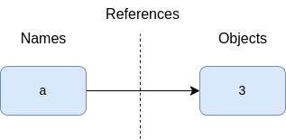
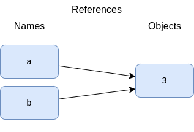
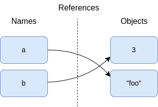

# Variables

## Assignments

In basic form, you write the _target_ of an assignment on the left of an equals sign,
and the _object_ to be assigned on the right.

__Names are created when first assigned__. Python creates a variable name the first time
you assign it a value.

__Names must be assigned before being referenced__. It’s an error to use a name to which
you haven’t yet assigned a value.

### Variable name rules

* Variable names must start with an underscore or letter, which can be followed by any
number of letters, digits, or underscores. Legal names: `_hack`, `hack`, `Hack_1`. Not
available: `1_hack`, `hack$`, `@#!`.
* Case matters: `HACK` is not the same as `hack` (in the names of imported module files
too).
* Reserved words are off-limits as a variable names.

Because module names in import statements become variables in your scripts, variable
name constraints extend to your module filenames too.

### Naming conventions

* Names that begin with a single underscore (`_X`) are not imported by a
`from module import *` statement.
* Names that have two leading and trailing underscores (`__X__`) are system-defined
names that have special meaning to the interpreter and provide implementation details in
the user-defined OOP classes.
* Names that begin with two underscores and do not end with two more (`__X`) are
localized (“mangled”) to enclosing classes.
* The name that is just a single underscore (`_`) retains the result of the last
expression when you are working interactively at some REPLs.

### Assignment syntax

Assignment syntax forms:

```python
target = 'hack'              # Basic assignment
code, hack = 'py', 'PY'      # Tuple assignment
[code, hack] = ['py', 'PY']  # List assignment
a, b, c, d = 'hack'          # Sequence assignment
a, *b = 'hack'               # Extended-unpacking assignment: a = 'h', b = ['a', 'c', 'k']
code = hack = 'python'       # Multiple-target assignment
code += 1                    # Augmented assignments
      # Named assignment expression
```

The `:=` operator allows you to code assignment as an expression, which returns the
value it assigns to a name. This expression can be nested in places where assignment
statements don’t work syntactically, and in common roles allows you to both assign a
name and use its value in the same place in your code.

```python
result = (pi := 3.14) + 0.1
# (pi := 3.14) assign value 3.14 to pi and return 3.14
# the result = 3.24
```

## Dynamic typing model

In Python, we use variables without their existence or their types. Types are determines
automatically at runtime.

## Variables, Objects, and References

```python
a = 3
```

__Variable creation__. A variable, like `a` is created when your code first assign it a
value. Future assignments change the value of the already created name.

__Variable types__. A variable itself never has any type information or constraints
associated with it. The notion of type lives with objects, not names. Variables simply
refer to a particular object at a particular point in time.

__Variable use__. When a variable appears in an expression, it is replaced with the
object that it currently refers to. Further, all variables must be explicitly assigned
before they can be used. Referencing unassigned variables results in errors.

When Python interpretr executes this code:

```python
a = 3
```

it will perform three steps to carry out the request. These steps reflect the operation
of all assignments:

1. Create an object to represent the value `3`
2. Create the variable `a`, if it does not yet exist.
3. Link the variable `a` to the new object `3`.

Variables and objects are stored in different parts of memory and are associated by
links. Variables are always link to objects and never to other variables, but larger
objects may link to other objects (for instance, a list object has links to the objects
it contains).

Links from variables to objects called _references_, implemented as an object's address
in memory.



Whenever variables are later used, Python automatically follows the variable-to-object
links.

* _Variables_ are named entries in a system table, with spaces for links to objects.
* _Objects_ are pieces of allocated memory, with enough space to represent the values
for which they stand.
* _References_ are automatically followed pointers from variables to objects

Each time you generate a new value in your script by running an expression, Python
creates a new _object_ (i.e., a new chunk of memory) to represent that value.

> As an optimization, Python internally caches and reuses certain kinds of unchangeable
> objects, such as small integers and strings.
>
> ```python
> x = 99
> x = 'Python'
> ```
>
> The project 99 here is probably not literally reclaimed. Instead, it will likely
> remain in a system table to be reused the next time you generate a `99` in your code.


Objects have more structure than just enough space to represent their values. Each
object also has two standard header fields:

* a _type designator_ used to mark the type of the object;
* a _reference counter_ used to determine when it's OK to reclaim the object.

### Type designator

> Types live with objects, not variables.

This makes possible code below:

```python
a = 3       # integer
a = 'hack'  # now it's a string
a = 3.14    # no it's a floating point
```

In this code we simply changed `a` to reference different objects.

_Objects_ know what type they are - each object contains a header field that tags the
object with its type (a pointer to an object; in our case `int`, `str` and `float`).

### Reference counter

```python
a = 3
a = 'text'
```

When `a` assigned to the string `text`, the object `3` is immediately reclaimed
(assuming it is not referenced anywhere else). The object's space is automatically
thrown back into the free space pool, to be reused for a future object.

This automatic reclamation of object's space is known as __garbage collection__.

Internally, Python accomplishes this feat by keeping a counter in every object that
keeps track of the number of references currently pointing to that object. As soon as -
and exactly when - this counter drops to zero, the object's memory space is
automatically reclaimed.

### Cyclic references

Besides reference counters, Python's garbage collection has a component that detects and
reclaims objects with __cyclic references__ in time. This component can be disabled if
you're sure that your code does not create cycles, but it is enabled by default.

Circular references are a classic issue in reference-count garbage collectors. Because
references are implemented as pointers, it's possible for an object to reference itself,
or reference another object that does.

```python
l = [1, 2]
l.append(l)
```

Because the reference count for such objects never drops to zero, they must be treated
specially. For details see the [gc](https://docs.python.org/3/library/gc.html) module
docs.

## Shared references

```python
a = 3
b = a
```

Variables `a` and `b` referencing the same object (pointing to the same chunk of memory
).



When multiple names referencing the same object it calls __shared reference__.

Next, we extend the session with one more statement:

```python
a = 3
b = a
a = 'foo'
```

Last statement makes a new object to represent the string value `"foo"` and sets `a` to
reference this new object. It does not change the value of `b`; `b` still references the
original integer object `3`.



For mutable objects, you need to be more aware of shared references, since a change one
from one name may impact others.

```python
l1 = [2, 3, 4]
l2 = l1
l1[0] = 101

print(l1)  # [101, 3, 4]
print(l2)  # [101, 3, 4] - l2 has changed implicitly
```

If you don't want such behaviour, _copy_ objects instead of referencing.

```python
# copy list using slicing
values = ['foo', 'bar', 'eggs']
values_copied = values[:]

# using copy() method
names = ['Sam', 'Frodo']
copied_names = names.copy()

# using constructors
numbers = {1, 2, 3}
numbers_copied = set(numbers)
```

```python
# using copy module
import copy

persons = [{'name': 'John', 'age': 28}, {'name': 'Jane', 'age': 23}]
persons_copied = copy.deepcopy(persons)
```

Bcause of Python’s reference model, there are two different ways to check for _equality_
in a Python program.

```python
l = [1, 2, 3]
m = l
l == m  # True - same values
l is m  # True - same objects

a = [4, 5, 6]
b = [4, 5, 6]
a == b  # True - same values
a is b  # False - different objects
```

Technically `is` simply compares the pointers that implements references.


```python
x = 99
y = 99
x == y  # True
x is y  # True: caching at work
```
